# F5 Engage XC WAAP

<br><br><br>

## Delete Existing Objects and Start Over for Class 2

Ensure you're still on your allocated ***NameSpace***, when you follow the below steps.

<br><br><br>


### Delete HTTP Load Balancer Objects

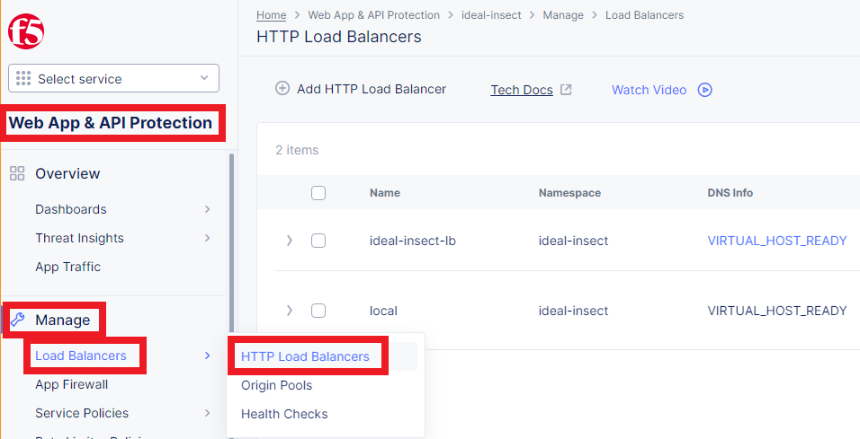
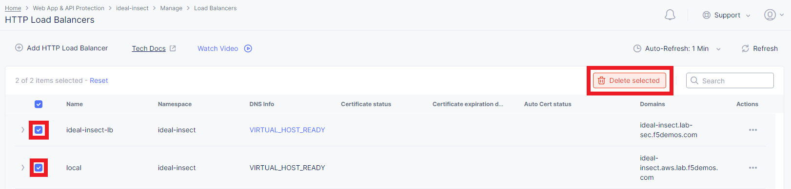
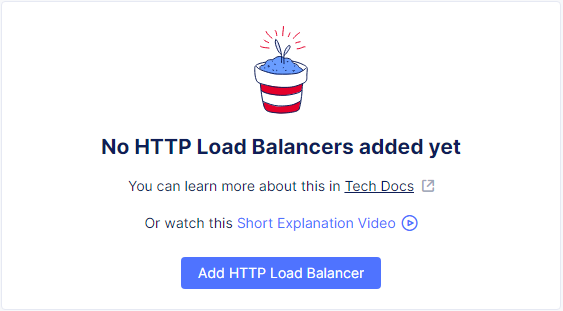

<br><br><br>


### Delete Origin Pool Objects

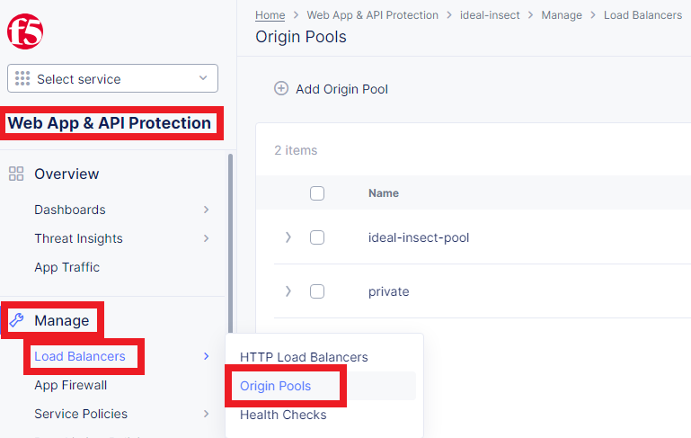
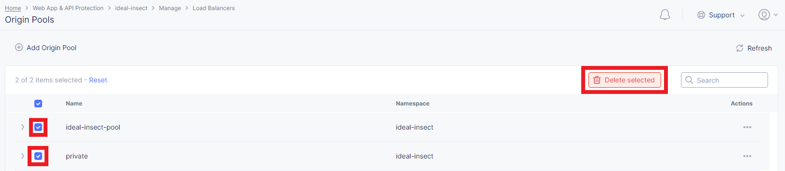


<br><br><br>


### Delete Health Check Object(s)

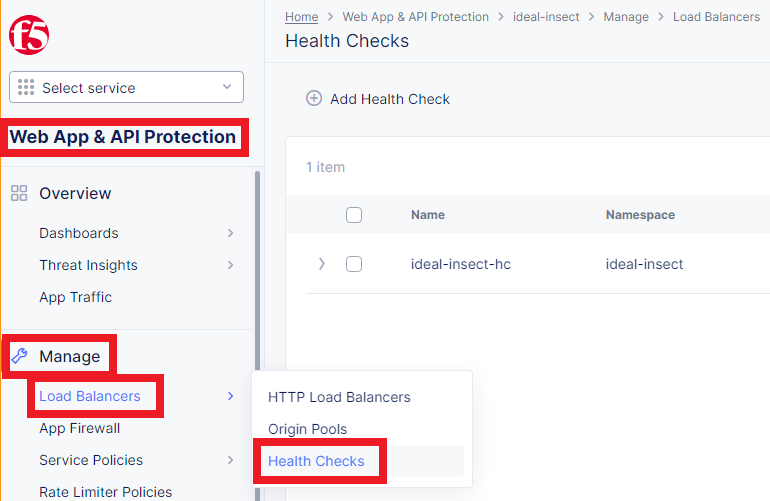
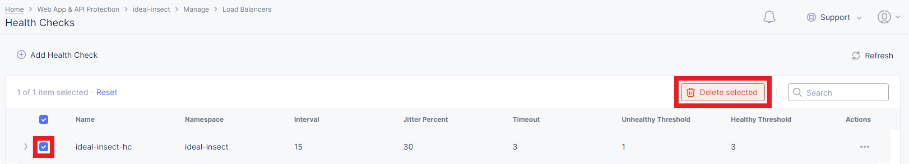


<br><br><br>


### Delete Application Firewall Object(s)

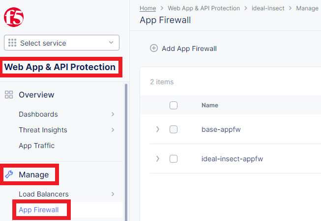
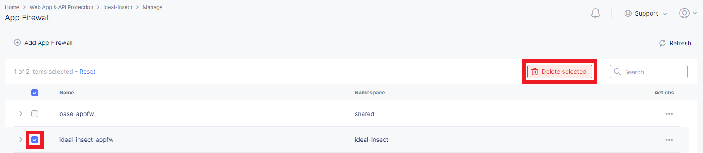
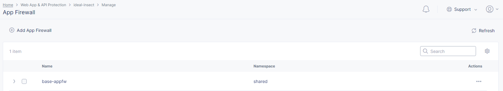

<br><br><br>


### Delete Service Policy Objects

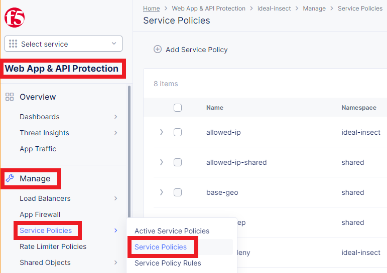
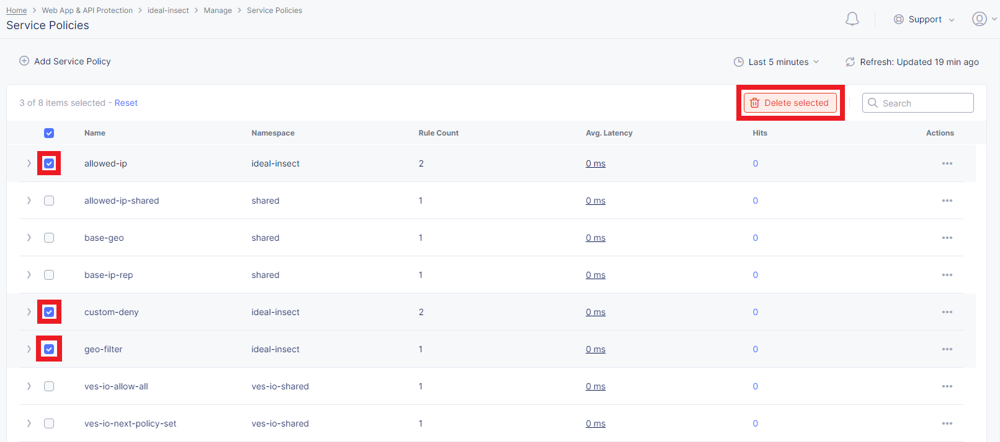
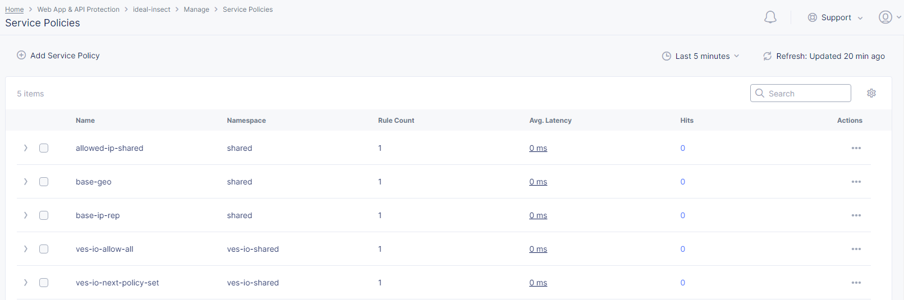

<br><br><br>


### Continue with the Official Class Guide

Once student has deleted existing objects as guided on above steps; student shall continue back to the official Class 2 guide: [F5 Distributed Cloud - WAF/WAAP Deeper Dive](https://clouddocs.f5.com/training/community/f5xc/html/class2/class2.html).

<br><br><br>


***

<br><br><br>
```
╔═╦═════════════════╦═╗
╠═╬═════════════════╬═╣
║ ║ End of Document ║ ║
╠═╬═════════════════╬═╣
╚═╩═════════════════╩═╝
```
<br><br><br>


