# F5 Engage XC WAAP

This repository is additional and ***temporary*** document for Asean F5 Engage Asean - Distributed Cloud Hands-On - Web Application and API Protection (WAAP).

F5 Engage conducted two hands-on classes:
- [ ] Class 1: [F5 Distributed Cloud - Introduction to Deployment Models and Services](https://clouddocs.f5.com/training/community/f5xc/html/class1/class1.html) ([Lab 1](https://clouddocs.f5.com/training/community/f5xc/html/class1/lab1.html), [Lab 2](https://clouddocs.f5.com/training/community/f5xc/html/class1/lab2.html) and [Lab 3](https://clouddocs.f5.com/training/community/f5xc/html/class1/lab3.html) only)
- [ ] Class 2: [F5 Distributed Cloud - WAF/WAAP Deeper Dive](https://clouddocs.f5.com/training/community/f5xc/html/class2/class2.html) ([Lab 1](https://clouddocs.f5.com/training/community/f5xc/html/class2/lab1.html) and [Lab 2](https://clouddocs.f5.com/training/community/f5xc/html/class2/lab2.html) only)

However, each class should start with assumption of a new/clean XC NameSpace.
While for F5 Engage this may not be the case, this document's purpose is bridging the gap when student has finished Class 1, and about to start Class 2, while their NameSpace still has objects created from Class 1.

<br><br><br>


## Delete Existing Objects and Start Over for Class 2

Ensure you're still on your allocated ***NameSpace***, when you follow the below steps.

<br><br><br>


### Delete HTTP Load Balancer Objects

Ensure you are on the `Web App & API Protection` service.
Click on the `Manage`, `Load Balancers` and `HTTP Load Balancers`.

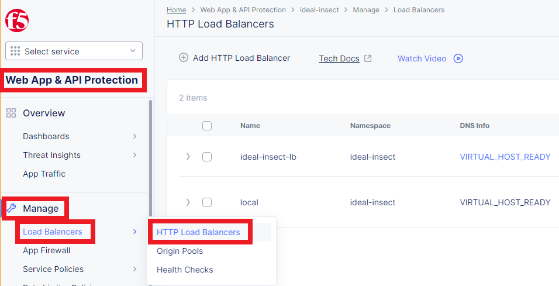

Select the ***HTTP Load Balancer*** objects you created previously, and click `Delete selected` on top of the list/table.

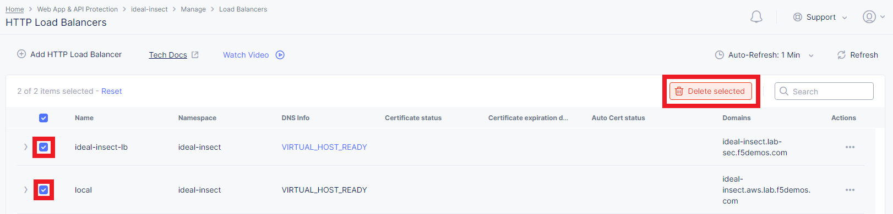

Once you've deleted the ***HTTP Load Balancer*** objects you created previously, the ***HTTP Load Balancer*** page should appear similar to the below.

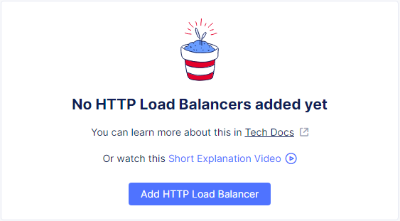

<br><br><br>


### Delete Origin Pool Objects

Ensure you are on the `Web App & API Protection` service.
Click on the `Manage`, `Load Balancers` and `Origin Pools`.

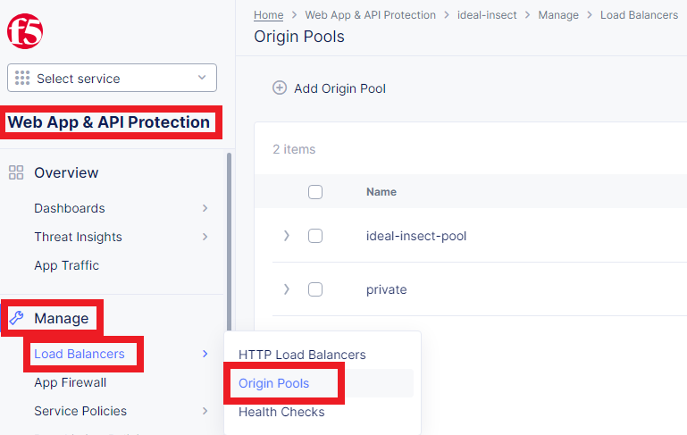

Select the ***Origin Pool*** objects you created previously, and click `Delete selected` on top of the list/table.

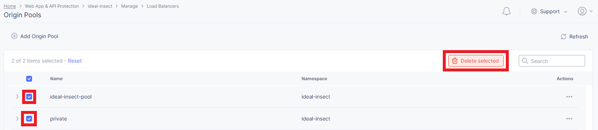

Once you've deleted the ***Origin Pool*** objects you created previously, the ***Origin Pool*** page should appear similar to the below.

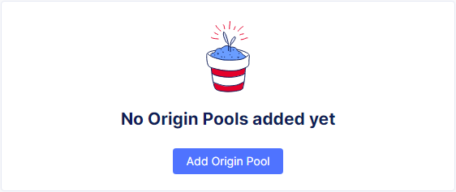

<br><br><br>


### Delete Health Check Object(s)

Ensure you are on the `Web App & API Protection` service.
Click on the `Manage`, `Load Balancers` and `Health Checks`.

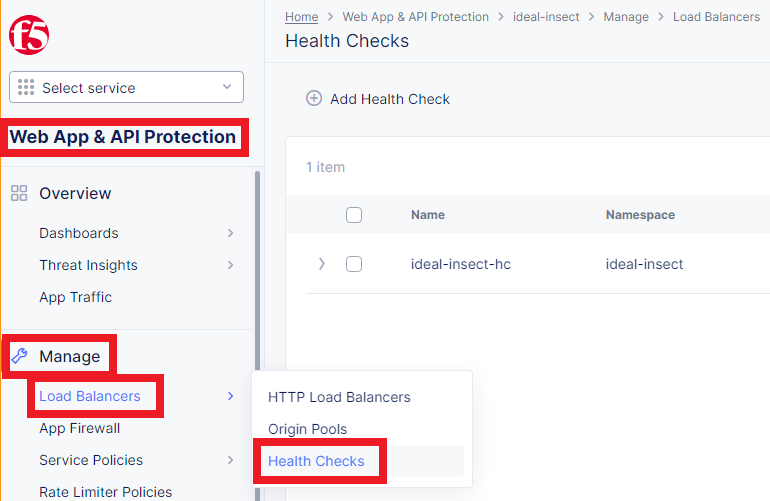

Select the ***Health Check*** object(s) you created previously, and click `Delete selected` on top of the list/table.

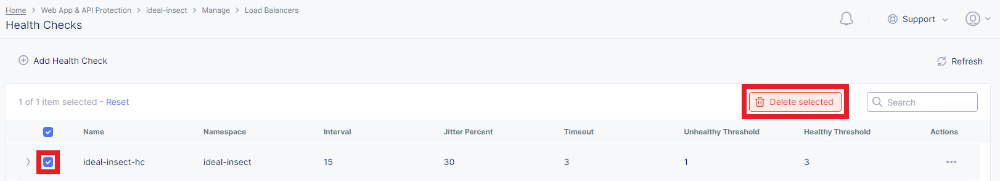

Once you've deleted the ***Health Check*** object(s) you created previously, the ***Health Check*** page should appear similar to the below.

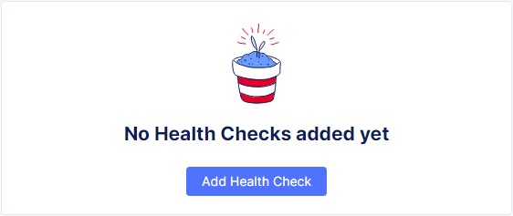

<br><br><br>


### Delete Application Firewall Object(s)

Ensure you are on the `Web App & API Protection` service.
Click on the `Manage` and `App Firewall`.

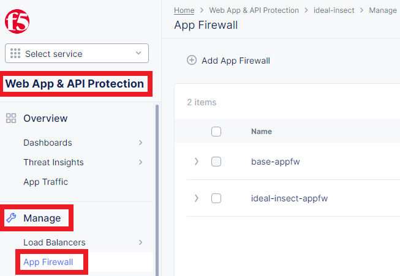

Select the ***App Firewall*** object(s) you created previously, and click `Delete selected` on top of the list/table.
Do ***NOT*** delete ***App Firewall*** objects which are ***NOT*** under your allocated ***NameSpace***.

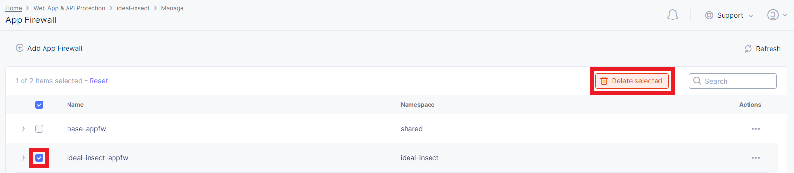

Once you've deleted the ***App Firewall*** object(s) you created previously, the ***App Firewall*** page should appear similar to the below.

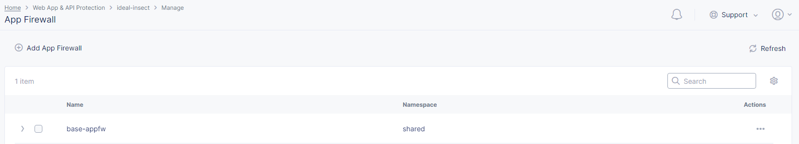

<br><br><br>


### Delete Service Policy Objects

Class 1 Lab 1, 2 and 3 do not use ***Service Policy*** objects.
So if you've just finish Class 1 Lab 1, 2 and 3, go ahead skip this section and continue with the next section.
However, if you've finish Class ***1*** Lab 1, 2 and 3 ***AND*** Class ***2*** Lab 1, 2 and 3; and want to retry the hands-on again, you need to delete the ***Service Policy*** objects also.

Ensure you are on the `Web App & API Protection` service.
Click on the `Manage`, `Service Policies` and `Service Policies`.

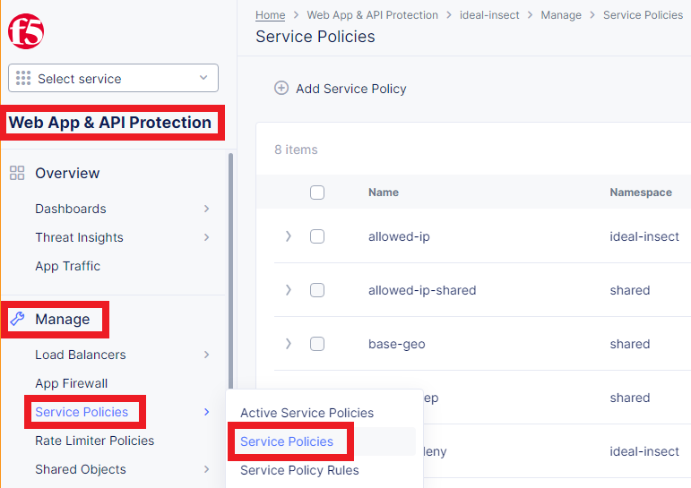

Select the ***Service Policy*** objects you created previously, and click `Delete selected` on top of the list/table.
Do ***NOT*** delete ***Service Policy*** objects which are ***NOT*** under your allocated ***NameSpace***.

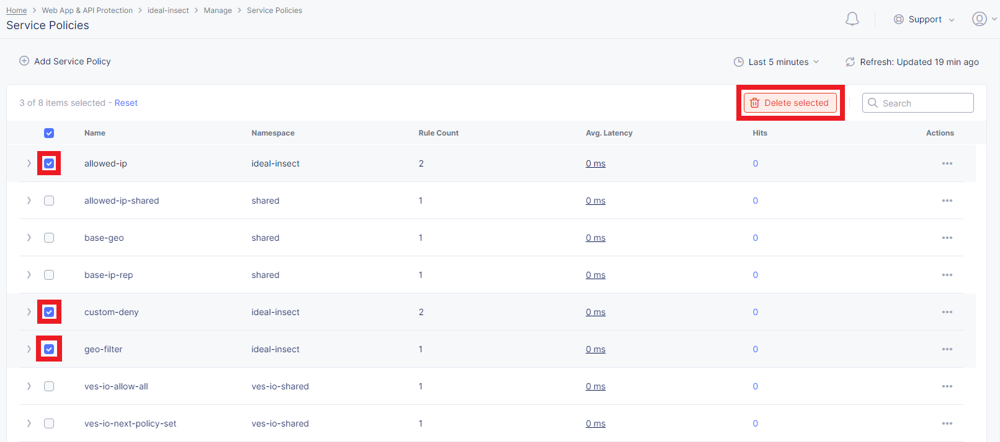

Once you've deleted the ***Service Policy*** objects you created previously, the ***Service Policy*** page should appear similar to the below.

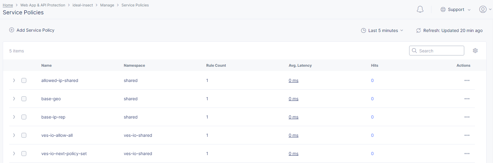

<br><br><br>


### Continue with the Official Class Guide

Once student has deleted existing objects as guided on above steps; student shall continue back to the official Class 2 guide: [F5 Distributed Cloud - WAF/WAAP Deeper Dive](https://clouddocs.f5.com/training/community/f5xc/html/class2/class2.html).

<br><br><br>


***

<br><br><br>
```
╔═╦═════════════════╦═╗
╠═╬═════════════════╬═╣
║ ║ End of Document ║ ║
╠═╬═════════════════╬═╣
╚═╩═════════════════╩═╝
```
<br><br><br>


