# F5 Engage XC WAAP

<br><br><br>

## Re-Use Existing Objects for Class 2

Class 2: [F5 Distributed Cloud - WAF/WAAP Deeper Dive](https://clouddocs.f5.com/training/community/f5xc/html/class2/class2.html) uses the same ***HTTP Load Balancer***, ***Origin Pool***, and ***App Firewall*** objects as in Class 1, with some minor changes in the detailed configurations.


<br><br><br>

### Change the Origin Pool of the HTTP Load Balancer

Ensure you are on the `Web App & API Protection` service.
Click on the `Manage`, `Load Balancers` and `HTTP Load Balancers`.

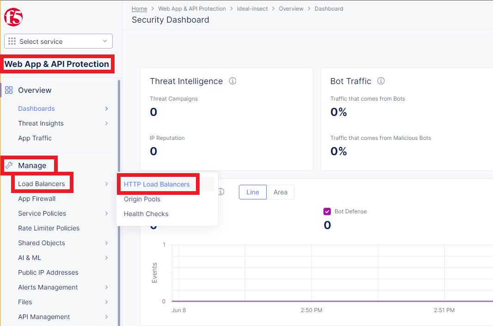

On the row of `[namespace]-lb`, click on the `...` button and the click on the `Manage Configuration`.

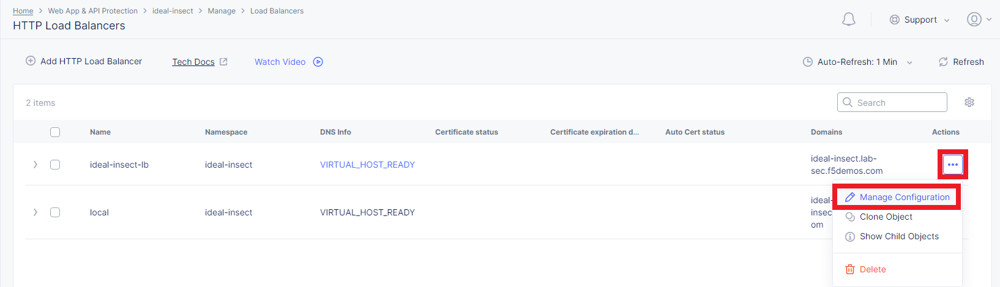

On the top of the page, click `Edit Configuration` to enable for modifications.

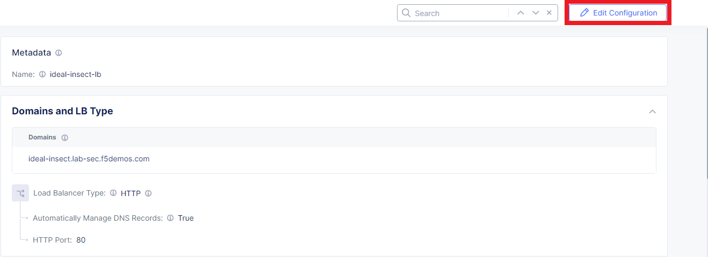

Scroll down to the ***Origins*** section.
On the row of ***Origin Pool***, click on the ***Pencil*** button.

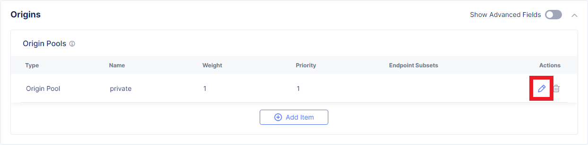

On the ***Origin Pool with Weight and Priority*** section/page, click on the `Origin Pool` selection, and select `[namespace]/[namespace]-pool`.
Click on `Apply` at the bottom of the page.

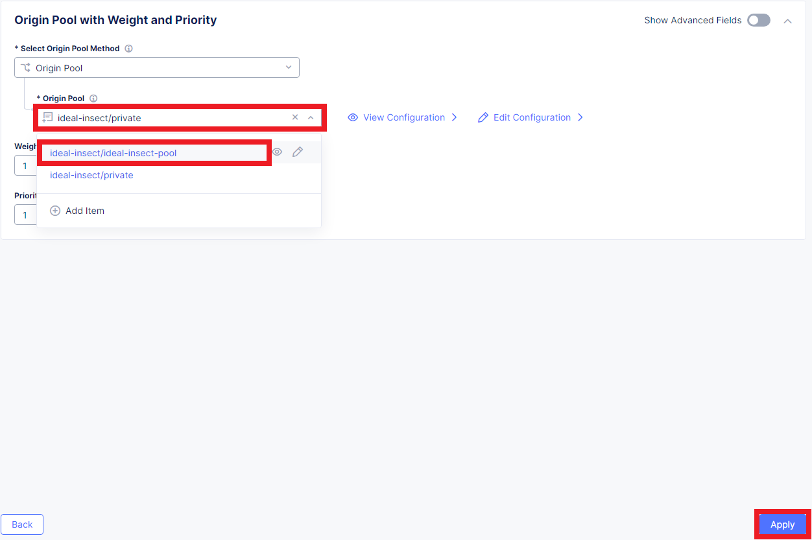

After the above step, the ***Origin Pools*** should look similar to below.

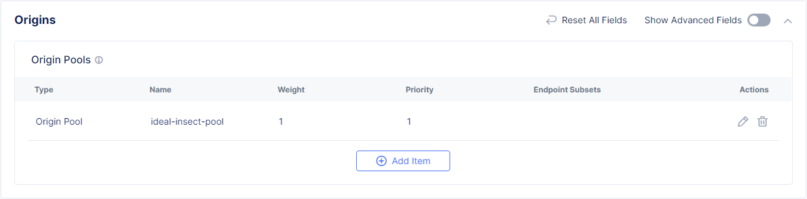

Scroll to the bottom of the ***HTTP LB Configuration*** page and click `Save and Exit`.

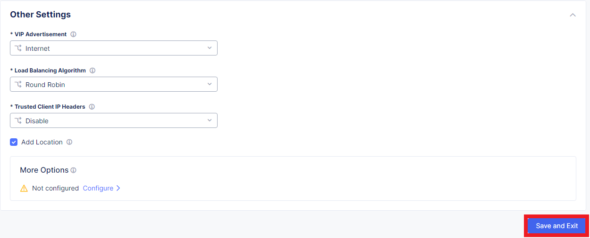

<br><br><br>


### Change the Application Firewall Configuration

Ensure you are on the `Web App & API Protection` service.
Click on the `Manage` and `App Firewall`.

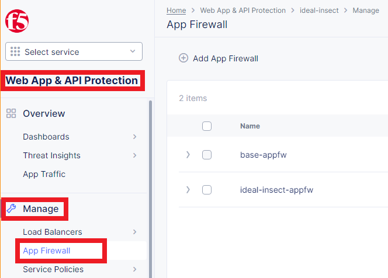

On the row of `[namespace]-appfw`, click on the `...` button and then click/select on the `Manage Configuration`.

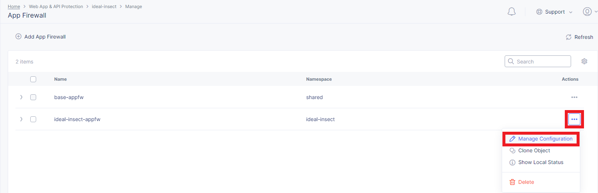

On top of the next page, click `Edit Configuration` to enable for modifications.


Scroll down to ***Detection Settings***.
On `Security Policy` selection, select `Custom`.

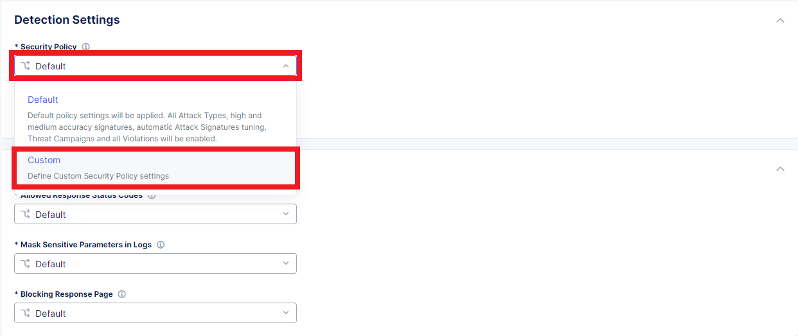

The ***Security Policy*** section expands its ***Attack Signatures*** detail configuration.
On `Signature Selection By Accuracy` selection, select `High, Medium and Low`.


Scroll to the bottom of ***App Firewall Configuration*** page and click `Save and Exit`.

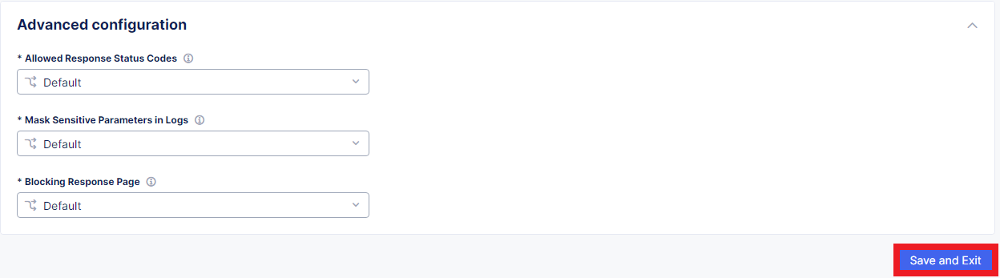

<br><br><br>


### Continue with the Official Class Guide

Once student has made changes to the ***ReUsed*** objects, student shall go back to the official Class 2 guide: [F5 Distributed Cloud - WAF/WAAP Deeper Dive](https://clouddocs.f5.com/training/community/f5xc/html/class2/class2.html), Task 2 Point 10.


<br><br><br>

***

<br><br><br>
```
╔═╦═════════════════╦═╗
╠═╬═════════════════╬═╣
║ ║ End of Document ║ ║
╠═╬═════════════════╬═╣
╚═╩═════════════════╩═╝
```
<br><br><br>


